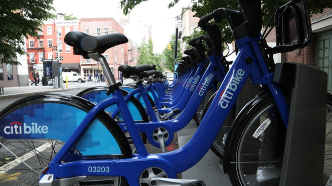

     
# **New York City Bike Analysis**

## **Objective:** 
* Uncover hidden phenomenon and trends within the New York Citi Bike data. The analysis aims to improve strategy and tactics, regarding target marketing areas/customers and efficient bike station placement.
  * Questions:
    * What are the most / least popular Citi Bike stations, since 2016? Can they data help Citi Bike add or remove locations?
    * Number of rides by gender and age, any trends? How can these trends in demographics help expand within the market and maintain clientele as well. 
    * Rides by user type (customer or subscriber). Are Citi Bike customers generally customers or subscribers? What ages fall in each category? Has this changed since 2016? How can Citi Bike utilize this information?

## **Tableau Visualizations**
  * [Click Here](https://hedeencharles.github.io/Citibike_Analysis/index.html) to view <u>Tableau stories website</u>
    * The website showcases three Tableau Stories with similar yet different objectives. Analysis will be used for efficiency improvements and recommendations for target marketing. 

## **Written Analysis**
  * [Click Here](https://hedeencharles.github.io/Citibike_Analysis/analysis.html) to view <u>analysis on website</u>
    * The above link includes a written analysis and recommendations for Citi Bike group.

## **Softwares used:**
* ### Tableau
  * **Visualizations and Analysis;** visualized uncovered trends and created three Tableau stories for presenting analysis and communicate recommendations. 
* ### Python Jupyter Notebook
  * **Extract;** automated the Notebook to pull in a local directory of CSV files downloaded from [New York Citi Bike Data](https://s3.amazonaws.com/tripdata/index.html). 
  * **Transform;** automated the Notebook to perform data cleaning. This included taking care of missing data, matching datasets that structurally changed over the years and matching columns.
  * **Load;** automated the Notebook to then concatenate all the CSV files into one DataFrame and exported the DataFrame to a CSV file called 'cleaned_2016_2020_05-10.csv'. This CSV file was then loaded into Tableau for visual analysis.
  * **Exploration;** utilized Python's Pandas and Matplotlib library to further analyze and combine datasets. I identified and noted outliers and other trends in the data before jumping into Tableau.

  
## **Data Source Citation:**
* ### New York Citi Bike Data:
  * [Documentation](https://www.citibikenyc.com/system-data)
  * [CSV Files](https://s3.amazonaws.com/tripdata/index.html)
  * URL: https://www.citibikenyc.com/system-data